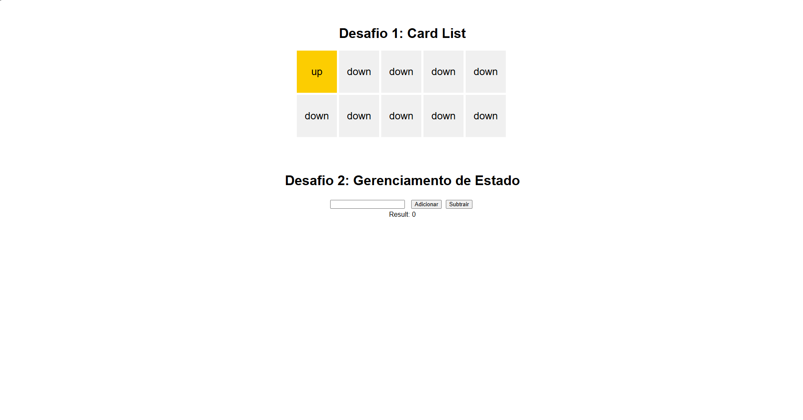

# Zé Delivery (React)



Este repositório contém dois desafios de codificação front-end utilizando React. Esses exercícios surgiram como parte de um desafio técnico proposto pelo [Zé Delivery](https://www.ze.delivery/) em 2022. O desafio está separado em duas branches: `challengeOne` e `challengeTwo`.  
Esses desafios têm como objetivo testar suas habilidades em desenvolvimento com React, bem como seu conhecimento sobre as features do JavaScript.  
**O tempo dado para resolução deste dois desafios foi cerca de 60 min.**

## Iniciando o projeto

```bash
# Clonar aplicação
$ git clone https://github.com/sillasemanoel/ze-delivery.git

# Acessar a aplicação
$ cd ze-delivery

# Execute npm para instalar as dependências
$ npm install

# Para iniciar a aplicação
$ npm run dev

```

## Ferramentas

- React
- Vite
- ESLint
- TypeScript

## Aprendizados importantes

- Manipulação de estado com useState e useReducer
- Componentes funcionais e eventos
- Renderização condicional
- Interação com inputs

## Funcionalidades

### Desafio 1: CardList

Este desafio consiste em passar um valor do tipo `number` para um componente chamado `CardList`, e esse componente deve renderizar o número de cartas que ele recebe como propriedade (`size`).  
  Inicialmente, todas as cartas devem estar viradas para baixo, ou seja, devem conter a palavra `down`. Assim que o usuário clicar em uma dessas cartas, ela deve mudar seu conteúdo para `up`. No entanto, só podemos ter uma carta com a palavra `up` por vez. Portanto, ao clicar em outra carta, a carta que estava previamente com `up` deve voltar a ser `down`, e o novo elemento clicado deve mudar para `up`.

### Desafio 2: Gerenciamento de Estado
Este desafio envolve 2 botões e um input, chamados `add`, `subtract` e um input do tipo `number`. O aplicativo deve funcionar da seguinte maneira:
  - Caso não haja nenhum valor no `input` e o botão `add` seja clicado, deve-se adicionar **1** ao valor salvo no estado.
  - Caso não haja nenhum valor no `input` e o botão `subtract` seja clicado, deve-se subtrair **1** do valor salvo no estado.
  - Caso haja algum valor no `input` e o botão `add` e/ou `subtract` seja clicado, esse valor deve ser adicionado e/ou subtraído ao valor salvo no estado.
  - O valor salvo no estado deve ser mostrado dentro de uma `<div data-testid="results"></div>`.
    É **obrigatório** o uso do `useReducer` para gerenciar o estado deste componente.
