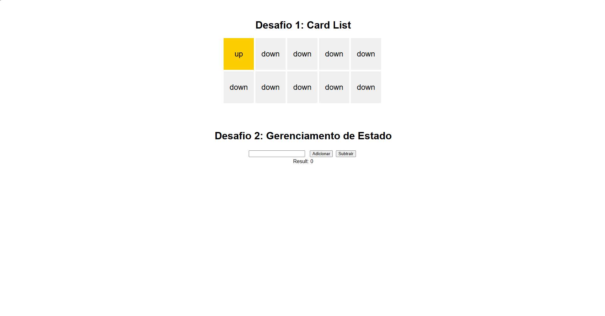

<h1 align="center">
    
</h1>
<p align="center">Aplicativo criado como parte de um teste prático para a vaga na Acelera ZG, focado na resolução de problemas e aplicação de conhecimentos em JavaScript.</p>
<p align="center">
 <a href="#sobre-o-projeto">Sobre o Projeto</a> |
 <a href="#tecnologias">Tecnologias</a> |
 <a href="#como-comecar">Como Começar</a> |
 <a href="#licenca">Licença</a> |
 <a href="#autor">Autor</a> 
</p>

### Sobre o Projeto

Esta aplicação foi desenvolvido como parte de um teste prático para a vaga na Acelera ZG. O projeto consistia em resolver dois problemas:

1. **Levantar uma carta e manter as outras no chão**: Implementar uma funcionalidade onde uma carta pode ser levantada, enquanto as outras permanecem em uma posição fixa.
2. **Contador de Unidades**: Criar um contador que exibe o número de unidades, com funcionalidades para incrementar e decrementar o valor.

---

### Tecnologias

- [React](https://reactjs.org/) - Biblioteca para construir interfaces de usuário, utilizada para criar a estrutura da aplicação.
- [TypeScript](https://www.typescriptlang.org/) - Superset do JavaScript que adiciona tipos estáticos, utilizado para aumentar a robustez do código.

---

### Como Começar

```bash
# Clone o repositório
$ git clone https://github.com/sillasemanoel/ze-delivery

# Navegue até o diretório do aplicativo
$ cd devlinks

# Instale as dependências
$ npm i

# Para iniciar o aplicativo
$ npm run dev
```

---

### Licença

Distribuído sob a Licença MIT. Veja [LICENSE](LICENSE) para mais informações.

---

### Autor

Feito por Sillas Emanoel 👋🏽
